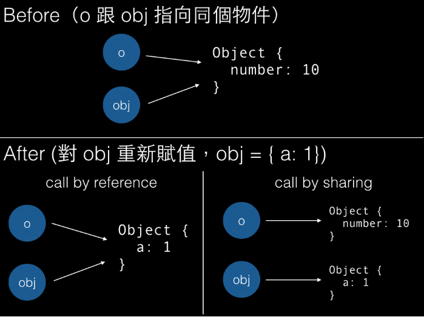

# javascript 是 pass by value 、 pass by reference 還是 pass by sharing？

## 前言

在轉職初期，我對 JavaScript 中「pass by value、pass by reference」這個議題一直是一知半解。轉職後在撰寫專案時，盡量使用 `structuredClone`、`JSON.parse(JSON.stringify(obj))` 或函式庫提供的 `cloneDeep` 來處理深拷貝，避免修改傳參考的新物件時影響到原始物件。

最近在重新學習 JavaScript 基礎時，看到了這篇 [深入探討 JavaScript 中的參數傳遞：call by value 還是 reference？](https://ithelp.ithome.com.tw/articles/10292389) ，才發現原來這個議題這麼深，JavaScript pass by sharing？JavaScript 都是 pass by value？primitive 是 passed by value，objects 是 passed by reference？

接下來就讓我們一起深入了解 JavaScript 中的參數傳遞吧 ～

## Primitive Type & Object Type

在探討參數傳遞之前，我們需要先理解 JavaScript 中的兩種資料型別，因為它們在記憶體中的儲存方式完全不同。

### Primitive Type (基本型別)

JavaScript 有 7 種基本型別：

- `string`
- `number`
- `bigint`
- `boolean`
- `undefined`
- `symbol`
- `null`

基本型別的特性是**值直接儲存在變數本身**，當我們複製或傳遞時，會複製實際的值。

```javascript
let a = 10
let b = a // 複製值

b = 20
console.log(a) // 10 (不受影響)
console.log(b) // 20
```

在記憶體中的樣子：

```
a → 10
b → 20  (獨立的值)
```

### Object Type (物件型別)

除了基本型別以外，其他都是物件型別：

- `Object`
- `Array`
- `Function`
- `Date`
- `RegExp`
- 等等...

物件型別的特性是**變數儲存的是記憶體位址(參考)**，而不是實際的值。

```javascript
let obj1 = {value: 10}
let obj2 = obj1 // 複製參考

obj2.value = 20
console.log(obj1.value) // 20 (被影響了!)
console.log(obj2.value) // 20
```

在記憶體中的樣子：

```
obj1 → [記憶體位址 0x001]
obj2 → [記憶體位址 0x001]  (指向同一個位置)
         ↓
    { value: 20 }
```

了解這兩種型別的差異後，我們就可以開始探討參數傳遞的方式了。

## Pass by Value (傳值)

Pass by value 的核心概念是：**傳遞的是「值的拷貝」**，函式內對參數的修改不會影響到原始變數。

### 基本型別的行為

```javascript
function changeValue(x) {
  x = 100
  console.log('函式內:', x) // 100
}

let num = 50
changeValue(num)
console.log('函式外:', num) // 50 (未改變)
```

**發生了什麼事？**

1. 呼叫 `changeValue(num)` 時，會將 `num` 的值 `50` **複製**一份給參數 `x`
2. 在函式內修改 `x = 100`，只是改變了拷貝的值
3. 原始的 `num` 完全不受影響

```
函式外:  num → 50
函式內:  x → 50 (複製的值)
修改後:  x → 100 (只改變拷貝)
結果:    num → 50 (原始值不變)
```

### 為什麼基本型別是 Pass by Value？

因為基本型別在記憶體中儲存的就是**實際的值**，所以傳遞時自然就是傳遞值的拷貝。這確保了函式內的操作不會意外改變外部的變數。

## Object 是 Pass by Reference (傳參考)？

先說說 Pass by reference 的定義，**傳遞的是「變數本身的參考」**。

因此：

- 函式內的參數是原變數的別名（alias）。
- 對參數重新賦值（reassignment）或修改其內容，都會改變呼叫端（函數外部）的變數。

如果是真正的 pass by reference，以下範例的 `original` 應該要被重新賦值才對，但實際上沒有。

```javascript
function reassign(obj) {
  obj = {name: 'New Object'}
  console.log('函式內:', obj.name) // 'New Object'
}

let original = {name: 'Original'}
reassign(original)
console.log('函式外:', original.name) // 'Original' (沒變!)
```

### C++ 中真正的 Pass by Reference

在 C++ 中，使用 `&` 符號可以實現真正的 pass by reference：

```cpp
#include <stdio.h>

// 注意這邊多了 &，代表傳參考
void swap(int &a, int &b) {
  // a 和 b 的記憶體位置與外部變數相同
  printf("%ld, %ld\n", &a, &b); // 假設是 0x44, 0x40

  int temp = b;
  b = a;
  a = temp;
}

int main(){
  int x = 10;
  int y = 20;

  printf("%ld %ld\n", &x, &y); // 0x44, 0x40
  swap(x, y);
  printf("%d %d\n", x, y); // 20, 10 (成功交換!)
}
```

**關鍵差異**：在 C++ 的 pass by reference 中，函式內的 `a` 和外部的 `x` 擁有**完全相同的記憶體位置**，它們是同一個變數，只是有不同的名稱（alias）。當你改變 `a` 時，就是在改變 `x`。

但 JavaScript 沒有這種機制。

## Pass by Sharing

既然 JavaScript 的物件型別如果不是 pass by reference，那到底是什麼？

-> **Pass by Sharing**（也稱為 call by sharing 或 call by object sharing）。

### 什麼是 Pass by Sharing？

Pass by sharing 的核心概念是：**傳遞的是「物件參考的副本」**，不是物件本身，也不是原始參考。

這聽起來很抽象，讓我們用例子來理解：

```javascript
function add(obj) {
  obj.number++
}

var o = {number: 10}
add(o)
console.log(o.number) // 11
```

```javascript
function add(obj) {
  // 讓 obj 變成一個新的 object
  obj = {
    number: obj.number + 1,
  }
}

var o = {number: 10}
add(o)
console.log(o.number) // 10
```

**發生了什麼事？**

### 第一個例子：修改物件屬性

```javascript
function add(obj) {
  obj.number++ // 修改物件的屬性
}
```

**記憶體狀態：**

```
初始狀態:
o → [0x001] { number: 10 }

呼叫 add(o):
o   → [0x001] { number: 10 }
obj → [0x001] (參考的拷貝，指向同一個位置)

執行 obj.number++:
o   → [0x001] { number: 11 }  // 兩者都指向同一個物件
obj → [0x001] { number: 11 }
```

### 第二個例子：重新賦值

```javascript
function add(obj) {
  obj = {number: obj.number + 1} // 重新賦值
}
```

**記憶體狀態：**

```
初始狀態:
o → [0x001] { number: 10 }

呼叫 add(o):
o   → [0x001] { number: 10 }
obj → [0x001] (參考的拷貝，指向同一個位置)

執行 obj = { number: obj.number + 1 }:
o   → [0x001] { number: 10 }     (保持不變)
obj → [0x002] { number: 11 }     (指向新物件)
```



圖片來源：[深入探討 JavaScript 中的參數傳遞：call by value 還是 reference？](https://blog.techbridge.cc/2018/06/23/javascript-call-by-value-or-reference/)

## 結論

### JavaScript 的 Pass by Sharing 機制

在 JavaScript 中,所有參數傳遞都採用 "pass by sharing"(共享呼叫)機制。這意味著傳入的項目是按值傳遞的,但這個按值傳遞的項目本身就是一個參考。

如果 obj1 根本不是參考,那麼在函式內修改 obj1.item 將不會影響函式外部的 obj1。但如果這是真正的傳參考機制,那麼一切都會被改變:num 會變成 100,而 obj2.item 會讀取為 "changed"。

實際情況是:如果你改變參數本身(如 num 和 obj2 的情況),這不會影響傳入參數的原始項目。但如果你改變參數的內部結構(如 obj1 的情況),這個改變會向上傳播,影響到外部的物件。

```javascript
function changeStuff(a, b, c) {
  a = a * 10 // 改變參數本身
  b.item = 'changed' // 改變參數的內部結構
  c = {item: 'changed'} // 改變參數本身
}

var num = 10
var obj1 = {item: 'unchanged'}
var obj2 = {item: 'unchanged'}

changeStuff(num, obj1, obj2)

console.log(num) // 10 (不受影響)
console.log(obj1.item) // "changed" (內部改變向上傳播)
console.log(obj2.item) // "unchanged" (不受影響)
```

| 型別               | 傳遞方式        | 修改值            | 重新賦值          |
| ------------------ | --------------- | ----------------- | ----------------- |
| **Primitive Type** | Pass by Value   | ❌ 不影響原始變數 | ❌ 不影響原始變數 |
| **Object Type**    | Pass by Sharing | ✅ 影響原始物件   | ❌ 不影響原始變數 |

1. **所有的基本型別都是 pass by value** - 傳遞的是值的拷貝
2. **所有的物件型別都是 pass by sharing** - 傳遞的是參考的拷貝
3. **JavaScript 沒有真正的 pass by reference** - 無法改變原始變數的指向

### JavaScript 只有 call by value？

從底層實作的角度來看，JavaScript 確實只有 call by value，關鍵在於理解物件變數儲存的究竟是什麼——它儲存的是記憶體位置（指標），而非物件本身。

讓我們用具體例子說明：當你宣告 var o = {number: 10} 時：

- 從上層視角：變數 o 的值是 {number: 10} 這個物件
- 從底層視角：變數 o 的值其實是記憶體位置，例如 0x01

當你將 o 傳入函式時，JavaScript 複製的是這個記憶體位置 0x01，而非整個物件。

這就是為什麼函式內外的變數能「指向」同一個物件——它們持有相同的記憶體位置。

從這個角度理解，所謂的 call by sharing（傳遞共享）本質上就是 call by value 的特殊形式。你傳遞的確實是「值的拷貝」，只不過這個值恰好是指向物件的記憶體位置。

因此，究竟該說 JavaScript 是 pass by value、pass by reference，還是 pass by sharing？其實沒有絕對的對錯，關鍵在於你從哪個層次來理解和解釋這個行為。

## 最後

這篇文章幫助我重新理解 JavaScript 參數傳遞的特性，希望也能幫助你理解這個重要但常被誤解的概念！

## 參考資料

- [深入探討 JavaScript 中的參數傳遞：call by value 還是 reference？](https://blog.techbridge.cc/2018/06/23/javascript-call-by-value-or-reference/)
- [重新認識 JavaScript: Day 05 JavaScript 是「傳值」或「傳址」？](https://ithelp.ithome.com.tw/articles/10191057)
- [今天要來點 pass by value、pass by reference 還是 pass by sharing 呢？](https://ithelp.ithome.com.tw/articles/10292389)
- [Is JavaScript a pass-by-reference or pass-by-value language?](https://stackoverflow.com/questions/518000/is-javascript-a-pass-by-reference-or-pass-by-value-language)
